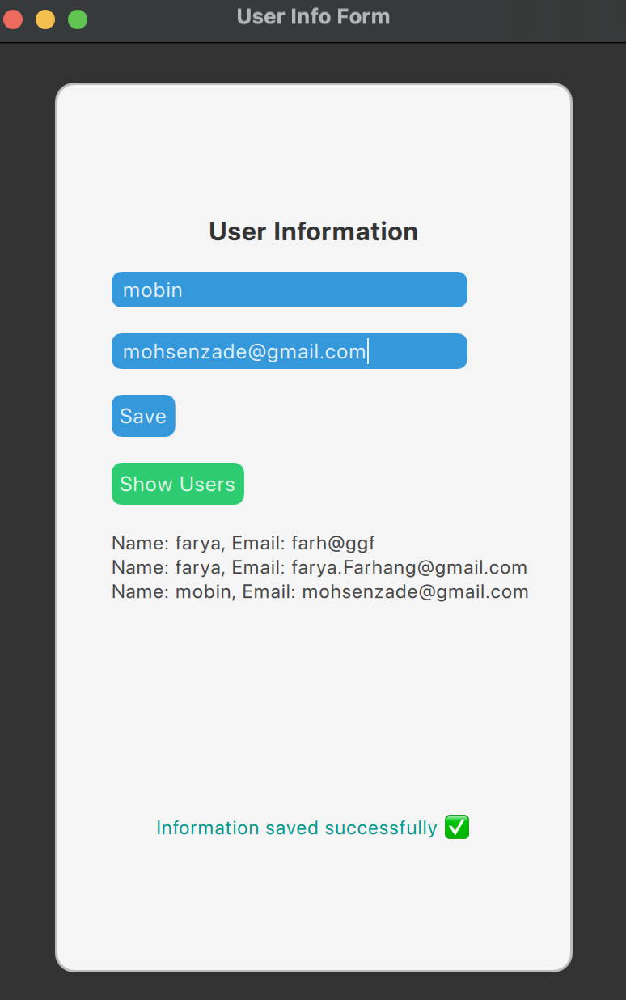

# 📋 User Info Form (Qt Quick + C++)

A simple and practical desktop application built with **Qt (QML + C++)** to collect user information (name + email), save it to a file, and display it in a list.

---

## ✨ Features

- User form with **name** and **email** input fields
- Saves data to a text file (`userdata.txt`)
- Reads and displays user data in a **ListView**
- Full communication between **QML and C++**:
  - Use of `Q_INVOKABLE` functions
  - Custom `signals` to notify QML from C++

---

## 🗂 Project Structure

| File / Path               | Description |
|---------------------------|-------------|
| `main.cpp`                | Entry point of the app, links QML and C++ |
| `userhandler.h/.cpp`      | C++ class to handle saving/loading user data |
| `main.qml`                | UI: form, buttons, ListView |
| `userdata.txt`            | Plain text file to store user info |
| `CMakeLists.txt`          | CMake build configuration |
| `qml.qrc` *(optional)*    | QML resource file (if used) |
| `.vscode/settings.json` *(optional)* | VS Code settings for Qt |

---

## 🚀 How to Run

1. Clone or download this repository
2. Open the project in **VS Code** or **Qt Creator**
3. Build the project using **CMake**
4. Run the app 🏃

---

## 🛠 Dependencies

- Qt 6.x (tested with 6.5+)
- CMake 3.16+
- VS Code (recommended) or Qt Creator

---

## 📌 Note

- Data is saved to `userdata.txt` in the same directory as your project.
- File path is relative, so the data file stays outside the `build/` folder.

---

## 👨‍💻 Author

Made with ❤️ by [Farya Farhangtehrani]  
Feel free to ⭐ the repo or contribute!

## 🖼 Preview

Here is a preview of the user interface:

